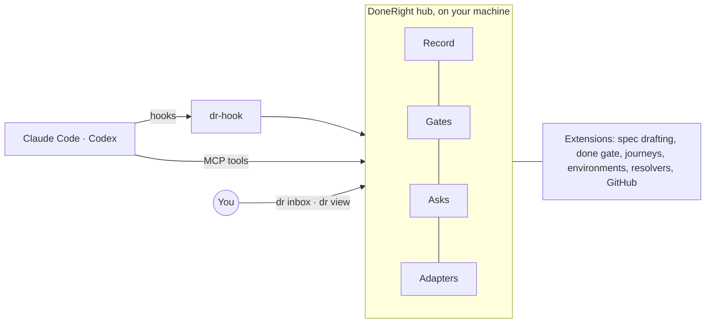

# DoneRight

**Your coding agent says it's done. DoneRight checks it's done right, and asks you only what needs a person.**

> [!NOTE]
> **Status: design.** Nothing is built yet. This README describes version 0, due November 8, 2026. Follow along in the [milestones](https://github.com/windoliver/doneright/milestones) and the [build plan](docs/plan.md).

Writing code is cheap now. Knowing a change is right is the bottleneck. In a 30-day pilot, one founder asked agents "is it really done?" about 600 times, and 73 fixed bugs came back at least once. DoneRight takes over that checking: the checks run themselves, the evidence is kept, and you get only the calls that need you.

## Highlights

- **Proof, not promises.** When an agent claims "done", "fixed" or "no visible change", DoneRight runs the checks itself. A fix counts only if its check fails on the old code and passes on yours.
- **No config to write.** `dr setup`, run once per machine, drafts each repo's checks from what's already there: CI, package scripts, `AGENTS.md`, and the checks you kept asking agents about. It runs each one once and asks you to approve. Agents propose the rest, such as a journey for a page they change.
- **Five honest verdicts.** `PASS`, `FAIL`, `INCONCLUSIVE`, `BLOCKED` and `INVALID`. A skipped or unrun check is never green.
- **Only what needs you.** Taste calls, approvals, and blocks only you can clear land in one inbox. Answers you've given before are reused, and your answer goes straight back into the agent's running session.
- **Real surfaces.** Browser journeys run on your real local stack, with video and screenshots as evidence. Ports, test accounts and devices are leased per session, so parallel agents don't collide.
- **Works with your agents.** Claude Code (terminal and desktop app) and Codex in version 0; pi and Cursor next. No SDK.
- **Local first.** Everything runs and stays on your machine. Nothing is sent anywhere by default.
- **Local CI.** Each verdict is a GitHub commit status that branch protection can require, with no hosted runners.
- **Small core.** Everything beyond proving claims and asking you is an extension you can turn off, replace or write yourself, the way [pi](https://github.com/earendil-works/pi) works.

## Quick start

Version 0 runs from a checkout and needs Node 22.19 or newer and Rust. The npm package, with prebuilt binaries, comes in R2.

```bash
git clone https://github.com/windoliver/doneright && cd doneright
npm install && npm run build
npm link     # puts `dr` on your PATH
dr setup     # once per machine: learns from your agent history, adds the hooks, drafts each repo's checks
dr doctor    # checks the hooks, ports, disk and sign-ins
```

You don't write any config, and there's nothing to run in each repo. `dr setup` reads your agent history and writes what it learned into a local wiki, every line with its source. It asks only what your history leaves unclear:

```text
$ dr setup
Read 212 sessions and 64 notes on this machine, in 3 repos: shop, api, docs.
Wrote your wiki: ~/.doneright/wiki, 38 pages. Every line names its source.
3 things weren't clear:
1  api starts two ways in your history. Which should agents use?
     a  docker compose up api   since Sep 12 · 14 sessions · recommended
     b  npm run dev             before Sep 12 · 9 sessions
   [a/b/other/skip] a
2  Before/after screenshots on UI changes: you asked 41 times in shop, never on hotfix branches.
   Ask on hotfixes too? [y/N/skip] n
3  STRIPE_TEST_KEY came from ~/.config/shop/stripe.env 30 times and from your shell twice.
   Always use the file? [Y/n/skip] y
Add hooks for Claude Code and Codex at user level? [y/N/diff] y
✓ Set up. Agents read your wiki when they start. Each repo's checks come to you when an agent starts work there.
```

Setup doesn't touch any repo. When an agent starts work in `~/code/shop`, its checks, drafted from the wiki and the repo and run once in the background, reach your inbox:

```text
Approve the drafted spec for ~/code/shop
Read CI, package.json, CLAUDE.md and your past sessions there. Ran each check once:
  unit        npm test              from ci.yml                     214 tests, 38 s
  typecheck   npm run typecheck     from ci.yml                     passed, 12 s
  lint        npm run lint          CLAUDE.md: "lint before done"   passed, 4 s
  e2e         npx playwright test   you asked about it 14 times     3 journeys, 71 s
  app         npm run dev           web on a leased port            ready at /health, 9 s
  left out    npm run test:visual   from package.json               ran 0 tests
Approve · Edit lines · Change it in your own words
```

Approve it once, and `dr` writes `.doneright/` for you to commit. Until then, verdicts in that repo are watch-only.

*The output is illustrative.*

From then on, the spec keeps itself current. A new CI step becomes a proposed change, and an agent that changes a page with no journey is asked to propose one. Each proposal reaches you once, and agents can't change the checks themselves. To see a repo's spec or change it in your own words, run `dr spec` there.

Work as usual. When an agent says it's done or opens a PR, DoneRight steps in. These commands show what happened:

```bash
dr status    # every running session, and every verdict
dr inbox     # only the things that need you
dr view      # the local view: screenshots side by side, evidence, decisions
dr off       # escape hatch: every gate becomes watch-only at once (dr on to undo)
```

More in the [how-to guide](docs/how-to.md).

## What happens when your agent says "done"

1. **A claim is made.** DoneRight reads the agent's last message, the issue's acceptance criteria and the plan's proof section. A claim starts when the agent calls `dr_claim`, runs `gh pr create`, or ends its turn saying it's done, fixed or ready.
2. **Checks run.** Command checks run in a clean environment, and browser journeys run on your real stack. For a fix, each check also runs on the merge base, where it has to fail.
3. **A verdict comes back.**

| Verdict | Means | What happens next |
|---|---|---|
| `PASS` | The check failed before and passes now, over enough runs | The agent may stop, and the commit gets a green status |
| `FAIL` | Something got worse | The agent keeps working, with the smallest failing case |
| `INCONCLUSIVE` | Too few runs to tell | More runs are scheduled |
| `BLOCKED` | Something outside the code is missing: an environment, access or an approval | Its owner gets a drafted request |
| `INVALID` | The check is broken, can't fail, or ran nothing | The check gets fixed; agents can't edit it themselves |

4. **Open items are sorted.** The agent's "still open" list becomes open items. Only the ones that need you reach your inbox.

```text
$ dr status
sessions   3 working · 1 waiting on you · 0 stuck
verdicts   PASS 12   FAIL 2   INCONCLUSIVE 1   BLOCKED 1
inbox      2 taste calls · 1 approval

$ dr inbox
1  taste      checkout button moved 8px left       → dr view 1
2  approval   live payment test, about $0.40        yes / no
3  unblock    test account sign-in expired          owner: you
```

*The output is illustrative.*

## Prompts that work

You don't need special prompts. DoneRight briefs each session when it starts and checks the work when it ends. A few habits make it sharper:

| You want | Tell your agent | What DoneRight does |
|---|---|---|
| A repo set up without writing config | "Set up DoneRight for this repo, with journeys for sign-up and checkout." | The agent proposes the spec with `dr_propose`. DoneRight runs every check once on your stack and sends you one approval, with the journeys' videos |
| A fix that stays fixed | "Fix #123. Reproduce it with a failing test first, then say done." | Reads #123's acceptance criteria, and requires the test to fail on the merge base and pass on your branch |
| No visible change | "Refactor the billing module with no visible change." | Diffs the journeys against the merge base: screens, requests and timings |
| Work while you're away | "Finish the open PRs on this branch. Ask me only taste calls." | Runs slow checks in the background, posts verdicts as commit statuses, and batches taste calls in the inbox |
| A line it won't cross | "Ask me before anything that costs money or touches production." | The agent's question reaches your inbox as an approval, and the session waits for your answer |
| Fewer repeat questions | Answer once in `dr inbox` | Saves the answer as a decision and reuses it next time, listed under "Decided for you" |

You can also add this to your `AGENTS.md` or `CLAUDE.md`:

```markdown
## DoneRight
- When you believe a task is done, call `dr_claim` or say "done". DoneRight runs the checks; don't claim done without them.
- If you need a decision from me, use `dr_ask` and keep working on whatever doesn't depend on it.
- Never edit files under `.doneright/`. Propose a change with `dr_propose` instead.
```

The [how-to guide](docs/how-to.md) has more prompts, how drafting works, a full `done.yaml`, journeys and troubleshooting.

## How it fits together



- **The record** is an append-only event log plus a folder of evidence, named by content hash.
- **Gates** turn a claim into a verdict when something triggers them: an agent stopping, a command about to run, a PR opening.
- **Asks** are the only thing you see. Your answers are saved as decisions and delivered back into the session.
- **Adapters** connect each agent's hooks. **Extensions** do everything else.

The [technical design](docs/technical-design.md) covers the architecture, data model, interfaces and security.

## Security and privacy

- Everything stays on your machine. The local view listens only on `127.0.0.1`, with a new token each launch.
- Answers reach an agent as instructions, so only you can give them: from the CLI or the local view, never from a web page or tool output.
- Hooks install at user level only, never into a repo's settings. A repo's `.doneright/` specs, and the commands a draft tries, run only after you trust the project.
- Agents can't edit checks, expected outputs or your decisions. What they propose decides nothing until you approve it.
- Transcripts and evidence are redacted for keys and tokens as they come in.
- DoneRight never kills processes by name or port. It stops only what it started, by PID.

## How it compares

| Project | What it does | How DoneRight differs |
|---|---|---|
| [prove_it](https://github.com/searlsco/prove_it) | Blocks Claude Code from stopping until your tests pass, with background reviewers | Several agents, five verdicts with proof on the merge base, real-surface journeys, and an inbox that delivers answers back |
| [DoneGate](https://github.com/Tetusa1/DoneGate) | Completion needs the right commit, owned paths, a lease and evidence | The same rigor at agent stop time, plus your decisions and real-surface evidence |
| [donecheck](https://github.com/AtharvaMaik/donecheck) | A proof-of-done receipt file, with a placeholder scan | Checks run by the tool itself, with verdicts pinned to commits |
| [gh-signoff](https://github.com/basecamp/gh-signoff) | Local CI: sign off on your own commit | DoneRight posts its verdicts the same way |

We borrow from all four. The details are in [the product doc](docs/product.md#what-we-copy-from-teams-already-doing-this).

## FAQ

**Does it need an SDK?** No. It reads what agents and apps already record: transcripts, hooks, OpenTelemetry, your app's own tables and vendor usage APIs.

**Do I have to write `done.yaml`?** No. `dr setup` drafts it from your CI, scripts and instruction files for every repo in your agent history, and a repo you start later gets its draft when an agent starts work there. Agents propose journeys as they work. You approve each draft once, and you can still edit the file by hand.

**Does it send my code or transcripts anywhere?** No. Nothing leaves your machine unless you install and turn on an extension that syncs.

**Which agents does it support?** Claude Code (terminal and desktop app) and Codex in version 0. pi and Cursor come next.

**Does it replace CI?** For many projects it can. Verdicts are commit statuses that branch protection can require, so CI isn't needed just to prove a change.

**What if it gets in my way?** `dr off` makes every gate watch-only at once, and `dr setup --undo` removes everything it installed.

**Why "DoneRight"?** Because "done" isn't enough.

## Roadmap

| Release | Due | What it adds |
|---|---|---|
| [R1](https://github.com/windoliver/doneright/milestone/1) | Nov 8, 2026 | Proof of "done" for Claude Code and Codex, specs drafted for you, the inbox, the local view, browser journeys |
| [R2](https://github.com/windoliver/doneright/milestone/2) | Dec 6, 2026 | Trustworthy numbers, after-merge mode, pi, npm packages, PR comments and `dr report` |
| [R3](https://github.com/windoliver/doneright/milestone/3) | Jan 17, 2027 | Receipts, proof caching, tests that must bite, merged to released to checked live |
| [R4](https://github.com/windoliver/doneright/milestone/4) | Feb 21, 2027 | Guards for whole failure classes, team guards, memory and policy |
| [R5](https://github.com/windoliver/doneright/milestone/5) | Apr 4, 2027 | CI policies and triage |

## Documentation

- [How-to guide](docs/how-to.md): prompts, `done.yaml`, journeys, the inbox and troubleshooting.
- [Product](docs/product.md): the problem, what DoneRight solves, the roadmap and the decisions.
- [Technical design](docs/technical-design.md): architecture, data model, interfaces and security.
- [Build plan](docs/plan.md): every task and what it waits on.

## Contributing

See [CONTRIBUTING.md](CONTRIBUTING.md). The core stays small, and extensions are where most work goes. Agents working in this repo follow [AGENTS.md](AGENTS.md).

## License

[Apache-2.0](LICENSE)
