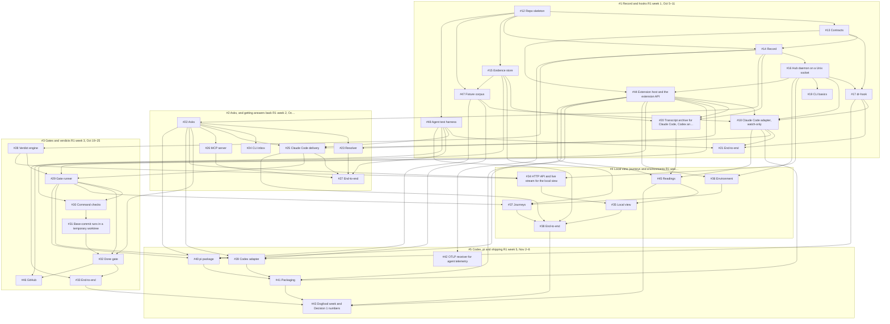

# Build plan

Generated from the issues. Each arrow points from a task to the tasks it unblocks. GitHub holds the same links as "blocked by" on each issue.

## Later releases

- #6 R2 · Find, and trust the numbers — blocked by #3
- #7 R3 · Change with proof — blocked by #6
- #8 R4 · Keep — blocked by #7
- #9 R5 · CI — blocked by #1, #6
- #10 Money and infra extensions — blocked by #6
- #11 Team server and enterprise preset (after Decision 2) — blocked by #4, #5

## Tasks

| Issue | Task | Epic | Blocked by |
|---|---|---|---|
| #12 | Repo skeleton: TypeScript workspace, Rust crate and local preflight | #1 | nothing |
| #13 | Contracts: JSON Schemas for events, the hook protocol, verdicts, asks and decisions | #1 | #12 |
| #14 | Record: append-only SQLite event log and projections | #1 | #12, #13 |
| #15 | Evidence store: content-addressed files, redaction and retention | #1 | #12 |
| #16 | Hub daemon on a Unix socket | #1 | #14 |
| #17 | dr-hook: Rust hook client with fail-open and fast rules | #1 | #13, #16 |
| #18 | Claude Code adapter, watch-only: sessions, tool calls and commits | #1 | #16, #17, #44, #47 |
| #19 | CLI basics: status, doctor, off and on, debug bundle | #1 | #16 |
| #20 | Transcript archive for Claude Code, Codex and pi | #1 | #14, #15, #44 |
| #21 | End-to-end: hook overhead and fail-open under real sessions | #1 | #17, #18, #48 |
| #22 | Asks: kinds, batching, daily cap and the inbox | #2 | #14 |
| #23 | Resolver: answer from saved decisions, logged as decided for you | #2 | #22, #44 |
| #24 | CLI inbox: list and answer | #2 | #22 |
| #25 | Claude Code delivery: Stop hold, background waiter and prompt context | #2 | #18, #22, #48 |
| #26 | MCP server: ask, wait, open items, status and search | #2 | #22 |
| #27 | End-to-end: an answer reaches an idle session; a repeat never reaches you | #2 | #23, #25, #26, #48 |
| #28 | Verdict engine: five outcomes, run counts, known failures and commit pinning | #3 | #14 |
| #29 | Gate runner: claim triggers, fast and slow lanes, concurrency | #3 | #25, #28, #44 |
| #30 | Command checks: hermetic runs and tests-run counts | #3 | #29, #44 |
| #31 | Base-commit runs in a temporary worktree | #3 | #30 |
| #32 | Done gate: specs, issue criteria, plan proof, open items and project trust | #3 | #22, #29, #31 |
| #33 | End-to-end: block a false done, pass the real fix, gate this repo | #3 | #32, #48 |
| #34 | HTTP API and live stream for the local view | #4 | #16, #22, #28 |
| #35 | Local view: Inbox, Live, Changes and Decided for you | #4 | #34, #45 |
| #36 | Environment: dr env up with leased ports and PID tracking | #4 | #16, #44 |
| #37 | Journeys: Playwright, end-state checks, evidence and a feature list | #4 | #15, #29, #36 |
| #38 | End-to-end: journey evidence in the view, taste call answered there | #4 | #25, #35, #37, #48 |
| #39 | Codex adapter: hooks, trust step and Stop hold delivery | #5 | #17, #22, #29, #47 |
| #40 | pi package: in-process client, native tools and sendUserMessage delivery | #5 | #22, #29, #44, #47 |
| #41 | Packaging: npm, prebuilt dr-hook, Claude Code plugin and dr init | #5 | #18, #39, #40, #44 |
| #42 | OTLP receiver for agent telemetry | #5 | #14 |
| #43 | Dogfood week and Decision 1 numbers | #5 | #33, #38, #41, #45 |
| #44 | Extension host and the extension API | #1 | #13, #16 |
| #45 | Readings: your time, agent spend and lifecycle numbers | #4 | #18, #20, #44 |
| #46 | GitHub: verdicts as commit statuses, PR comments and dr report | #3 | #15, #32 |
| #47 | Fixture corpus: recorded hook payloads and transcripts per agent version | #1 | #12, #15 |
| #48 | Agent test harness: scripted Claude Code, Codex and pi sessions | #1 | #12 |
