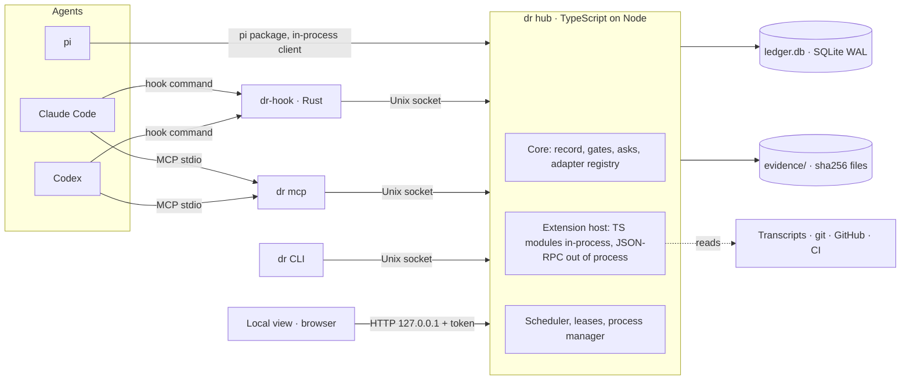
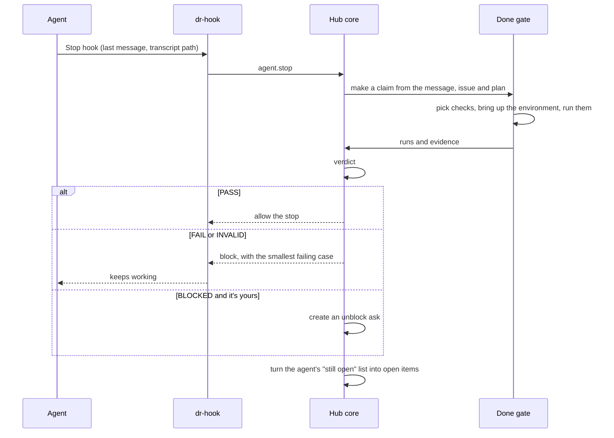
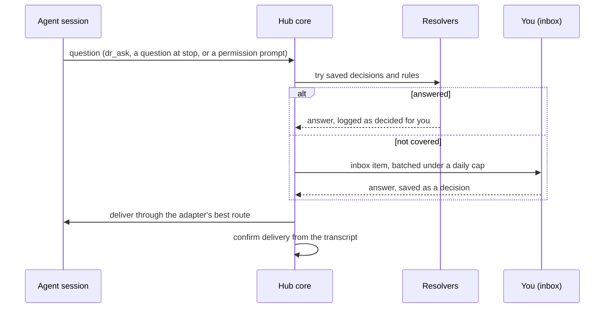

# DoneRight: technical design

> Version 0 is one TypeScript process per user, the hub, plus a tiny Rust hook client that every agent hook calls. The hub owns the record: an append-only SQLite event log and a folder of evidence named by content hash. It runs gates that turn an agent's claim into one of five verdicts, and routes asks to you only when a person is needed. It delivers your answers back into running sessions through each agent's adapter. Extensions load into the hub as TypeScript modules, the way pi loads its own. Everything ships through npm, runs on your machine, and sends nothing anywhere by default.

The product, its reasoning and the roadmap are in the [product doc](./product.md). This page covers how version 0 (release R1, October 5 to November 8) is built. The code, the issues and the Markdown copy of both docs live in [windoliver/doneright](https://github.com/windoliver/doneright).

## What version 0 builds, and what waits

### In version 0

- **The core:** the record, gates, asks and the adapter contract.
- **Adapters:** Claude Code (terminal and desktop app) and Codex (CLI and app). pi follows in R2.
- **Done gate:** runs when an agent says it's done. Checks come from the repo's `.doneright/` specs, the issue's acceptance criteria and the agent's plan. Nobody writes the specs by hand: they're drafted from what each repo already runs and from your wiki, agents propose journeys, and you approve once.
- **Your wiki:** `dr setup` writes what it learns from your history as markdown pages, every line with its source, and asks only where your history disagrees. Agents read a short slice when they start and search the rest, through an index any extension can replace.
- **Checks:** shell commands and browser journeys with Playwright.
- **Asks:** the inbox, a resolver that reuses your saved decisions, and delivery back into sessions.
- **Surfaces:** the CLI, the local view and the MCP tools.
- **Readings:** your time and agent spend from transcripts, plus lifecycle numbers from git and GitHub, enough to judge Decision 1.
- **Verdicts on GitHub:** a commit status that branch protection can require. The PR comment and `dr report` follow in R2.
- **Environment:** `dr env up` with leases on ports, test accounts, phone numbers, simulators and screens, each with a cap and a cooldown. Processes are tracked by PID.
- **Trust:** a transcript archive before agents delete old sessions, a doctor, and check health.

### Later, as extensions

- Readings and money: vendor bills, the infra map, FinOps.
- Policy beyond exact saved decisions, the memory keep-or-remove list, and fixes for recurring errors. Graph and vector indexes for the wiki, and a code graph, each rebuilt from its pages. Taste rules: after the same kind of taste call (same screen, same kind of change) gets the same answer three times, a rule is offered whose bounds are checks on the recorded element boxes, such as the total and the pay button staying in view; once you accept it, the resolver applies it, and prices, totals and outward-facing changes stay excluded. A Hindsight extension for people who already run it: wiki claims go into a bank per repo, `dr_search` uses its fused keyword, vector, graph and time recall, and its banks are read as one more memory source. It brings its own model and server, so it's never the default. Size budgets learned from the change sizes you accept and your "too complicated" remarks.
- In R2: parallel sessions (a session map, notices to each agent and dry merges) and plan usage per account and per task. See [Parallel and plans](#parallel-sessions-and-plan-limits).
- Team claims and merge checks across teammates' machines.
- CI policies, receipts in a signed attestation format, and exports beyond GitHub: the status line, the weekly brief and OpenTelemetry.
- Phone, text-message, desktop and chat-app journeys with leased real accounts.
- Agent spend caps, leased remote test machines, and the feature map that keeps itself current.
- In R2: the pi package, npm packaging with prebuilt binaries and the Claude Code plugin, the PR comment and `dr report`, and the OTLP receiver.
- In R2: a paseo adapter, so every agent you run through paseo, including those with no hooks of their own, gets the done gate, policy answers and dr's MCP tools, and Needs you reaches paseo's phone and desktop apps.
- The Cursor adapter, the team server and the enterprise preset.
- In R6: playbooks (`dr create`), scheduling within each account's plan windows, the agent and account picker, scores with replayed improvements, and driven sessions on one session contract, with ACP as the generic route.

## One hub per user, a tiny hook client, and extensions in-process



| Component | What it does | Runs as |
|---|---|---|
| dr hub | The only writer to the record. It hosts the core and the extensions, serves the local view, schedules check runs, holds leases, and tracks every process it starts so it can stop them by PID. It starts on demand and is safe to restart, because every consumer keeps its position in the event log. | One long-running Node process per user, listening on `~/.doneright/hub.sock` (mode 0600) |
| dr-hook | Called by every agent hook. It reads the hook's JSON from stdin and adds the agent name and event. It forwards that to the hub and prints the hub's reply. If the hub isn't running, it applies the local fast rules in `~/.doneright/rules.json` and otherwise allows the action, so a stopped hub never blocks your agents. Rules marked fail-closed still block. The defaults are no killing processes by name or port, and no CI workflow dispatch without approval. | A Rust binary of a few hundred lines, started once per hook call |
| dr CLI | `dr status`, `dr inbox`, `dr show`, `dr view`, `dr run`, `dr env up`, `dr doctor`, `dr setup`, `dr spec` and `dr install`. `dr off` turns every gate into watch-only at once, as an escape hatch, and `dr debug bundle` writes a redacted bundle for bug reports. When the hub is down, read commands open the database read-only. | Node, short-lived |
| dr mcp | The MCP server agents call: ask, wait, add an open item, run a check, declare a claim, attach evidence, start the environment. It forwards each call to the hub. | One stdio process per agent session |
| Local view | A static web app the hub serves with its JSON API and a live event stream. | Preact, built with Vite, served on 127.0.0.1 with a new token each launch |
| Extensions | Everything beyond the core, including the done gate, journeys, resolvers and adapters. TypeScript modules load into the hub. Other languages run out of process over JSON-RPC on stdio, like pi's RPC mode. | In the hub, or as child processes |

Everything lives under `~/.doneright/`: `config.json`, `ledger.db`, `wiki/`, `evidence/`, `rules.json`, `extensions/`, `archive/` and `logs/`. Per-repo specs live in the repo under `.doneright/`, so they're reviewed like code, and a guard stops agents from editing them.

## One event log, with tables built from it

The `events` table is the source of truth. Every other table is a projection the hub can rebuild by replaying events. IDs are ULIDs, so they sort by time. A project is identified by its repo root and remote URL. A session is identified by the agent's own session ID plus its worktree path.

```
CREATE TABLE events (
  id          TEXT PRIMARY KEY,          -- ULID
  ts          INTEGER NOT NULL,          -- ms since epoch
  project_id  TEXT,                      -- hash of repo root + remote
  session_id  TEXT,                      -- agent session id
  agent       TEXT,                      -- claude-code | codex | pi | cursor | dr
  kind        TEXT NOT NULL,             -- session.start, tool.before, claim.made, run.finished, ask.created …
  subject     TEXT,                      -- claim, ask or change id this event is about
  data        TEXT NOT NULL,             -- JSON, validated against the kind's schema
  evidence    TEXT                       -- JSON array of sha256 hashes
) STRICT;

-- Projections, rebuilt from events:
-- sessions(id, agent, project_id, worktree, branch, pid, status, last_seen)
-- claims(id, session_id, kind, subject_ref, text, created, verdict_id)
-- checks(id, project_id, name, type, spec_hash, lane, min_runs, owner, protected)
-- runs(id, check_id, claim_id, commit, env_fingerprint, started, ended, outcome, tests_run, evidence)
-- verdicts(id, claim_id, outcome, reasons, created)
-- asks(id, kind, key, question, options, session_id, owner, status, batch_id, created, answered)
-- decisions(id, key, scope, answer, by, ask_id, created, overruled_by)
-- leases(resource, holder_session, expires)
-- commits(sha, session_id, worktree, created)   -- recorded from the hooks, never from commit trailers
```

Each event kind carries a schema version. Migrations only move forward, and every projection can be rebuilt from the log.

Every adapter maps its agent's events onto the same few shapes, so rules, notices and gates never branch on an agent's name. A tool call has a kind (shell, read, edit, write, search or fetch) plus the paths and command it touches; Codex's `apply_patch` becomes an edit with the paths from its `*** Update File:` lines. A permission request has a kind (tool, plan, question or mode) and is answered allow or deny, optionally with edited input. An attention event says a session finished, failed or is waiting on a permission. Each turn reports its usage: input, cached and output tokens, cost, and how full the context window is. paseo maps seven agents onto nearly the same shapes, and its mappers are Apache-2.0.

### Evidence

- Each file is stored once at `evidence/ab/cdef….png`, named by its SHA-256, with its type and size in the log. A receipt that cites a hash can't point at a swapped file.
- Retention defaults to 30 days, except evidence behind a decision, which is kept. Evidence is never written into a repo.
- An image you paste into a session is evidence too, stored by hash with the message it came with and the change it's about. A bug report becomes a check the fix must pass; a taste remark becomes a decision with the image as its baseline.

### Privacy

- Transcript text is redacted on the way in: keys, tokens and anything that matches a secret pattern.
- Content-free mode keeps only counts, durations, error signatures and verdicts, never text.
- Nothing leaves the machine unless an extension that syncs is installed and turned on.

## How runs become one of five verdicts

```
verdict(claim):
  results = runs of every check selected for the claim
  if any check is missing something outside the code      → BLOCKED   (cause, owner, since)
  if any check ran nothing, can't fail, or, for a fix,
     also passes on the base commit                       → INVALID   (which check, why)
  if any check failed on a real run                       → FAIL      (smallest failing case)
  if any check has fewer clean runs than it needs         → INCONCLUSIVE (runs still needed)
  otherwise                                               → PASS

precedence when several apply:  FAIL > INVALID > BLOCKED > INCONCLUSIVE > PASS
every non-PASS check result also becomes an open item

runs needed for a check that may be flaky:
  n = ceil( ln(0.05) / ln(1 − p) )   p = the failure rate you accept
  p = 10% → 29 clean runs     p = 45% → 5     p = 1% → 299
```

- **Fail before, pass after.** For a fix, the check also runs on the merge base, in a temporary worktree that `dr` creates and removes. A check that passes there can't prove the fix, so it's INVALID. `dr` never stashes and never touches another worktree.
- **Check health.** Each run records how many tests actually ran. A run of zero tests, or a step that was skipped, counts as INVALID, never as a pass.
- **Pinned to a commit.** A verdict covers exactly one commit. A new commit marks it stale, and only checks whose inputs changed run again. The cache key is the commit, the spec's hash and the environment's fingerprint.
- **Known failures.** A failure can be accepted only by matching its exact error text, with an owner and an expiry date. Any other failure still fails.
- **Protection.** Specs under `.doneright/` and the expected outputs they reference are protected by a guard that is fail-closed. An agent proposes a change with `dr_propose`. A proposal runs at once, but it decides nothing until the owner approves it.

## Five ways in, all onto the same core

### Hook protocol (dr-hook and the hub)

```
// request, one JSON line on the socket
{ "v": 1, "agent": "claude-code", "event": "PreToolUse",
  "pid": 81234, "ppid": 81200, "payload": { …the agent's hook JSON, unchanged… } }

// reply: the hub's adapter has already mapped it to the agent's own output
{ "exit": 0, "stdout": "{\"hookSpecificOutput\":{…}}", "stderr": "" }
```

### Extension API (TypeScript, in-process)

```
export default function (dr: DR) {
  dr.on(event, handler)              // session.start · tool.before · tool.after · prompt.submit
                                     // agent.stop · pr.opened · merged · released · schedule
                                     // handler → { context?, deny? }: add context for the agent, or deny with a reason
  dr.registerCheck(type, runner)     // runner(spec, ctx) → { outcome, testsRun, evidence[] }
  dr.registerResolver(resolver)      // resolver(ask) → { answer, because } | undefined
  dr.registerSource(name, reader)    // reader(cursor) → { events[], cursor }
  dr.registerEnvironment(name, env)  // env.up(spec, lease) → handle · env.down(handle)
  dr.registerView(name, panel)       // a panel in the local view, or an export
  dr.registerAdapter(name, adapter)  // install(), mapHook(), deliver(answer, session), start(task)
                                     // adapter.caps: { holdStop, wakeIdle, steer, answerPermission, nativeTools, mcp }
                                     // start(task) → a driven session: startTurn · steer · interrupt · respond(permission) · history() · handle
  dr.startSession(task)              // { agent, worktree, prompt } through that agent's adapter, on your own sign-in (R6)
  dr.registerScheduler(scheduler)    // scheduler(task, plans) → { agent, model, when, why } (R6)
  dr.registerIndex(name, index)      // over the wiki: upsert(claims) · search(q) → hits with sources · dropSource(uri) · rebuild(pages)
                                     // neighbors() and vectors() only when the backend can
  dr.record.append(event) · dr.record.query(filter) · dr.evidence.put(file) → sha256
  dr.asks.create(ask) · dr.config.get(key)
}
```

Adapters declare what they can do, and delivery and gates choose a route from those flags, never from an agent's name: hold a stop when it can, steer into a running turn when it can, wake an idle session when it can, and otherwise wait for the next prompt. Sessions come in two kinds that produce the same events. Observed sessions are the ones you start in your own terminal or app, and dr-hook watches them. Driven sessions are the ones DoneRight starts itself (R6). A driven session follows the contract paseo uses across seven agents: create or resume, start a turn, steer into it, interrupt, answer a permission, and replay history from the agent's own transcript. ACP, the Agent Client Protocol, is the generic route for driven sessions, so an agent that speaks it needs no adapter of its own.

The core stays four parts: the record, gates, asks and adapters. Every use case, from the done gate to parallel sessions, plan usage and playbooks, is an extension on them; the product doc's table maps each one. The core refuses anything that would break an invariant. A check runner can't return PASS without run results, and a resolver can't answer a taste call without an explicit rule. Nothing outside the inbox can notify you.

| Interface | Shape | Used by |
|---|---|---|
| JSON-RPC | The same methods as the extension API, over stdio as JSON lines | Extensions and adapters written in any other language |
| MCP tools | `dr_ask` (waits, and says "still waiting" before the agent's tool timeout), `dr_wait`, `dr_claim`, `dr_propose` (proposes a check, a journey or a spec change; nothing applies until you approve it), `dr_run`, `dr_open_item`, `dr_evidence`, `dr_env`, `dr_status`, and `dr_search`, which searches your wiki, past decisions, verdicts and open items read-only, every hit with its source. Agents get no tool to answer, decide or overrule. | Claude Code and Codex. pi registers the same tools natively. |
| HTTP | `GET /api/inbox · sessions · changes/:id · evidence/:sha · numbers`, `POST /api/asks/:id/answer` (a choice, your words or an image), `POST /api/decisions/:id/overrule`, and a live stream at `/api/stream`. Every request needs the launch token and an Origin of 127.0.0.1. | The local view |
| OTLP (optional) | An OpenTelemetry receiver on 127.0.0.1 that turns an agent's own telemetry into events: Claude Code's tool spans, the time each call waited on you, and each model request's cost | Agents that export OpenTelemetry |
| CLI | `dr setup · spec · doctor · status · map · inbox · show · view · run · claim · env up\|down · report · off\|on · debug bundle · install · hub start\|stop` | You, and scripts |

## The three paths that matter most

### An agent says it's done



- **Knowing it's a claim.** Version 0 uses no model for this. A claim starts when the agent calls `dr_claim`, runs `gh pr create`, or ends its turn with words like "done", "fixed" or "ready".
- **Fast and slow lanes.** Checks that fit inside the hold, 60 seconds by default, run while the agent waits. Longer ones run in the background, the claim stays pending, and the verdict is delivered when it lands.
- **Open items.** Sections of the final message headed "still open", "not verified" or "next steps" are parsed into open items.
- **Stalled claims.** When a claim's open items come back unchanged on two stops in a row, with no new passing evidence, the hold stops sending the agent back for them. They become one decision for you: split the issue (what's proven closes now, and the rest moves to a new issue with what each item needs), fund the live runs it needs, or accept what's proven. A hold sends an agent back at most three times in a row without new evidence.
- **Size and scope.** Every claim gets a size check that runs no model: lines and files changed, new dependencies, top-level folders, services or cloud resources, files outside the plan, code no test reaches (knip and coverage), and duplicated blocks (jscpd). It compares them with the plan and with the changes you accepted for the same kind of issue in that repo, the median of the last 20. Over that, the hold sends the numbers back once, with "cut it to what the issue needs, or say why each part is needed"; still over, it's one taste call for you with the biggest additions. Size never turns a verdict to FAIL. When the plan marks an issue as large, its scope section, the files and parts it will touch, is sized before any code, and a plan past the usual size comes to you once.

### An ask, and your answer getting back



Delivery uses two words exactly, as paseo defines them. To steer is to add your answer to a turn that is still running, where the agent reads it at its next step. To interrupt is to stop the turn, which drops any steer the agent hasn't read yet, so DoneRight never interrupts to deliver. When a session can't be steered, the answer waits for the stop hold or the next prompt.

### Before each command

dr-hook first checks the fast rules in `rules.json`, such as no kills by name or port, no workflow dispatch without approval, no bare `git stash` (the stash stack is shared by every worktree) and no git aimed at another worktree, so these hold even when the hub is down. Adding a dependency, a service, a cloud resource or a top-level folder that the plan doesn't name is a decision, answered by your standing rule or asked; with the hub down it's allowed and recorded. It then asks the hub, which runs guards in watch, warn or block mode, the policy resolver for permission prompts, and lease checks for shared resources. Each decision is recorded as an event with its time and reason.

## What each agent gives us, and the limits we design around

| Agent | Hooks used | Getting an answer back | Transcripts | Known limits |
|---|---|---|---|---|
| Claude Code | SessionStart, UserPromptSubmit, PreToolUse, PermissionRequest, PostToolUse, Stop and SessionEnd. They ship as a Claude Code plugin at user scope, together with the MCP server and a short skill. Commits made in the session are recorded from the hooks. | A Stop hold returns `decision: block` with the answer. A background `asyncRewake` waiter exits with code 2 to wake an idle session. UserPromptSubmit and SessionStart add context as a fallback. | `transcript_path` from each hook, which can lag the live turn. The archive copies files before the 30-day cleanup. | Waking from the desktop app is untested. A waiter can outlive a headless session, so it watches its parent process. UserPromptSubmit hooks get 30 seconds. |
| Codex | The same events, in `~/.codex/hooks.json` | A Stop hold becomes the next prompt. Background hooks never start a turn, so an idle session hears back only on your next message. Sessions `dr` starts through app-server can get answers right away. | `transcript_path`, which Codex says isn't a stable format, so the adapter reads hook payloads first | Hooks you add yourself need a one-time trust approval in Codex's `/hooks`. Interrupt hooks get 1 to 3 seconds. The Codex app reads the same file, but two open reports say its hooks didn't run ([openai/codex#33992](https://github.com/openai/codex/issues/33992), [#47607](https://github.com/openai/codex/issues/47607)), so the Codex week tests the app too. |
| pi (R2) | A pi package in-process: session and tool events, plus native tools | `pi.sendUserMessage` starts a turn when the session is idle, and steers in or queues a follow-up when it's busy | JSONL files under `~/.pi/agent/sessions/`, grouped by working directory | The package runs inside pi, so it follows pi's own trust rules |
| Agents run through paseo (R2) | Claude sessions load your user, project and local settings, and paseo appends its own hooks to yours, so dr-hook fires as usual. Codex runs through app-server with your Codex home. For agents with no hooks to install (Copilot, OpenCode and any ACP agent), a paseo plugin acts on each turn's end and each permission request. | The plugin sends the answer into the session: a steer while a turn runs, a prompt when it's idle. Answers can also come from paseo's phone and desktop apps. | Each agent's own history, which paseo also treats as the durable record | Not yet tested in a paseo session. A Claude or Codex session must be gated once, by dr-hook or the plugin, not both. |
| Cursor (R2) | `hooks.json`: sessionStart, preToolUse, postToolUse, stop | A stop hold with `followup_message`, with `loop_limit` raised from its default of 5 | Hook payloads | No route to wake an idle local chat |

## First-party extensions that ship on by default

| Extension | What it does in v0 |
|---|---|
| done-gate | Makes a claim from the agent's last message. It reads the issue's acceptance criteria through the GitHub API, the plan's proof section if there is one, and the repo's `.doneright/done.yaml`. It picks checks, runs them, and maps the verdict to "Closes" or "Part of". It also turns the agent's "still open" list into open items, and flags placeholder text left in changed files. In a repo with no spec yet, it asks spec-draft for one, and only watches until you approve it. |
| wiki | Writes what DoneRight learns to `~/.doneright/wiki/` as markdown: `index.md`, `log.md`, a page about you, one per repo, the setup and your rules. Pages are the source of truth, and every index is rebuilt from them. They keep what your repos don't already say; what a repo file says is read from the file, not copied. Each line is a claim that keeps its source: the exact quote and where it came from (a transcript message, a memory-file line, a repo path at a commit, or your decision), the file's hash, when it was true, and how it was known: from you, from a repo file, or inferred by an agent. A claim whose quote isn't in its source is dropped, and summaries help find things but are never cited. Re-reading merges: each source keeps a read position, a contradicted claim is marked superseded rather than deleted, and a line you removed stays removed. Claims inferred by agents fade faster than claims from you. Each claim also keeps a proof count, the number of sources that agree, and standing questions such as "how does this repo start?" are pages the wiki rewrites as it learns, the way Hindsight's observations and knowledge pages work. Pattern matching runs first; free text goes in batches of new sessions through the agent you already use, headless, after a cheap "worth keeping?" check, inside the plan reserve. Two claims that disagree, or a one-off that would become a standing rule, become setup's questions: at most five, ranked by what a wrong guess would cost, asked one at a time. Each names what it changes and shows the evidence on each side (counts, dates and a quoted line), with the recommended answer first, plus Other and Skip. Answers are saved as decisions; skipped and lower-ranked questions wait as deferred until an agent starts work they affect. Everything else is recorded without asking, which is how the agents' own memories work too. A claim is re-checked against its source before it's used; one whose sources are gone, or that goes unused for 30 days, drops out, and newer evidence wins over older. New evidence against an answer you gave never overwrites it; it comes back as a question. Agents get a short slice at session start (the repo's page and your rules) and search the rest with `dr_search`; they propose changes and never write pages. Search is an index registered with `dr.registerIndex`. The default is SQLite FTS5 plus tables for claims, sources and links, in the ledger database. Vectors through sqlite-vec, or a graph through LadybugDB (the maintained fork of the archived Kuzu), can replace it, rebuilt from the pages, so swapping loses nothing. Entities merge only on exact keys, such as a path, a command or a variable name; unclear merges come to you. A repo map from tree-sitter, built with no model the way aider ranks files, links pages to code. |
| spec-draft | Drafts a repo's `.doneright/`, so nobody writes it by hand. It reads what the repo already says, without running anything: CI workflow steps, package scripts, Makefile and justfile targets, test-runner config, dev scripts or a compose file with ports and a health route, Playwright or Cypress suites, and "run this before saying done" lines in `AGENTS.md` or `CLAUDE.md`. It also reads your past "is it done?" asks in that repo from the transcript archive, so a check you kept asking about is named as the reason it's there. Once the project is trusted, it runs each candidate once in the hermetic runner, in the background and one repo at a time with leases, and leaves out any that runs zero tests or can't start, with the reason. Trust is reused from the agents: Claude Code's workspace trust and Codex's trusted projects already record which folders you trust, so a repo trusted in either needs no second answer, and a repo trusted in neither never runs. You approve the draft once, in the inbox or with `dr spec`, and `dr` writes the files for you to commit. Instead of a button you can say what to change in your own words; the change comes back as a diff of the draft, and nothing is written until you apply it. It reads the repo's page in your wiki too: how the stack starts, which credential each step needs (by name and source), and the checks you keep asking for. Each draft reaches the inbox when an agent session starts in its repo, with its checks already run, and verdicts there are watch-only until approved. A repo with no history gets its draft the same way at its first session, so there is no per-repo command; `dr spec` shows a repo's spec, drafts one now, or takes a change in words. Later, a changed source, such as a new CI step or a renamed script, becomes one proposed diff. It also validates and runs what agents propose with `dr_propose`: a check, a journey or a feature entry. |
| checks-command | Runs a shell command in the session's worktree and records its exit code, its output and how many tests ran. Runs are hermetic: a cleared environment with only allowlisted variables, a temporary home directory, and one process per check, so a pass can't depend on your machine's state. For fixes, it runs again on the merge base. |
| journeys | Drives a browser journey with Playwright against the environment and checks the end state. It starts from a feature list in `.doneright/features/`, which agents propose and you approve. When a change touches a feature with no journey, the agent that made it is asked to propose one. It saves video, screenshots and the trace as evidence, which outlives the environment's teardown. Each end-state check records the selector and bounding box it looked at, so a highlight can be drawn later. A journey that passes is saved as a replayable script. It runs the changed feature's journeys plus their nearest neighbors, the features that share changed files. |
| env-local | Starts the repo's own dev scripts or compose file and checks health. It leases ports per worktree, and test accounts, phone numbers, simulators and screens per session, each with a cap, a cooldown and a cost estimate. It tears everything down by PID. A spending budget is approved once per issue or per resource, with runs, a dollar cap and an end date; each run inside it is charged against the budget and goes ahead without an ask, and the agent hears what's left. Credentials are referenced by variable and source (a dotfile, a CLI login or a keychain item) and loaded only into the process that needs them; values never enter the record, the spec, evidence or the checkout. Setup rules you gave agents become checks before a command, such as running tests without a production-linked `.env`. |
| resolver-decisions | Answers an ask only when a saved decision matches its kind, its normalized question and its scope exactly. A near match is suggested to you, never applied on its own. Within a spending budget you approved, it also answers an agent's request to start a paid or live run, and says how much of the budget is left. |
| view | Three views, in the order you need them. Needs you: the asks, your next batch, and what was decided for you with an overrule. A taste call shows your past calls on the same screen and journey step, from the decisions table. Work: every session from every agent and repo, built for dozens at once: grouped by repo and issue, what needs you and what's stuck first, quiet sessions folded into one line, and flags for two sessions on one issue, an interrupted session and idle work that isn't pushed. A List \| Map switch shows the same work as a project map: parts from the repo's own structure (workspaces, packages, top-level folders and a tree-sitter repo map, with no model), sessions placed by the files they change, issues and PRs by branch and files, and evidence by the paths each check and journey covers, with the parts nothing proves marked as gaps. The infra map (R3) and the feature map (R4) are layers on it. Each change is one line, led by a plain sentence; an open change shows its end-to-end run (runs and clean runs, a screenshot per step, the checked end state with highlights beside it); passed checks fold into one line; the video, trace and receipt are one click deeper; the repo's spec. Numbers: readings outside their band first, then money, the infra map and the guards that fired. One count of what needs you appears everywhere, and color means status only. |
| archive | Copies Claude Code, Codex and pi transcripts into `~/.doneright/archive/` before each agent's cleanup deletes them, redacted the same way as ingestion. |
| readings | Your time and agent spend from transcripts: "is it done?" asks, rework, review wait, blocked time, failed calls by error signature, and tokens and cost. Lifecycle numbers from git and GitHub: time from issue to merge, first-pass merges and time to first review. |
| github | Posts each verdict as a commit status that branch protection can require, the way gh-signoff does local CI. In R2 it adds a PR comment with the verdict and open items, and `dr report`, one self-contained HTML file per change. `dr report --highlight` adds copies of the screenshots with what each check looked at marked in a strip beside the frame, never over it. A PR from an agent with no adapter, local or in the cloud, still gets the done gate on its commit and a posted verdict. |

```
# .doneright/done.yaml — drafted by dr setup, approved once, then protected
claims:
  done:
    checks: [unit, typecheck, journey:checkout]
  no-visible-change:
    checks: [journey-diff:all-main-routes]     # compared with the merge base
checks:
  unit:      { type: command, run: "npm test", min_tests: 1 }
  typecheck: { type: command, run: "npm run typecheck" }
  journey:checkout:
    type: journey
    file: .doneright/journeys/checkout.yaml
    runs: 3                                    # or accept: 10% to compute the runs needed
environment:
  up: "npm run dev"                            # or compose: docker-compose.yml
  ports: [web, api]                            # leased per worktree
  ready: { http: "http://localhost:${web}/health" }
```

## Parallel sessions and plan limits

Both build on what version 0 already records. Neither starts a session or spends a token on its own.

### Sessions that know about each other

Every hook call already carries the session ID, the working directory and the tool input, such as the file an edit touches or the command a shell runs. The hub keeps a session map from them: agent, worktree, branch, issue, changed files, running commands, leases and state. In R1 the map already drives the Work view and `dr status`. It flags two sessions on one issue; a session that ended without a claim because an app quit or a usage limit hit, read from the agent's own rate-limit record; and an idle session whose commits aren't on any remote branch. R2 adds the notices, dry merges and hard stops below.

- **Telling the agent.** Claude Code and Codex both take extra context from SessionStart, UserPromptSubmit, PreToolUse and PostToolUse hooks. At session start the agent hears who else is in the repo and on what. Before an edit to a file another session changed, it hears which session changed it and whether their branches conflict. After a sibling's change merges and touches its files, it's told to rebase before it says done.
- **Dry merges.** The hub runs `git merge-tree --write-tree` between in-flight branch tips, off the hook path, and reads only its exit code and the conflicting files. It touches no worktree or index. Uncommitted edits are compared by file and hunk from what the hooks reported, never by running git inside another worktree. Claude Code's Edit and Write name the file; a Codex edit is a raw patch, so the paths come from its `*** Update File:` lines.
- **Hard stops.** A PreToolUse deny, with the reason and the next free value, when a migration number or another declared unique name is already taken on a sibling branch, or a port or test account is leased to another session. Two sessions on one issue become one ask.
- **Load.** A timing check that fails while other sessions load the machine is rerun alone before it counts.
- **Safety.** Notices are built from facts (paths, issue numbers, line ranges, session names), never from another agent's text, so one agent can't instruct another. Codex hears a notice at its next tool call or message; an idle Claude Code session can be woken.

### Plan usage, per account and per task

On a subscription the limit is the plan's windows, not dollars. Both agents report them locally, and `dr` reads them without touching a credential.

- **Claude Code.** The status line receives `rate_limits.five_hour` and `rate_limits.seven_day` (percent used and reset time) on Pro and Max plans, after a session's first reply. `dr` installs a status line command that forwards them to the hub and then runs yours unchanged. The account is the account ID Claude Code keeps beside its login, not the login itself. Sessions `dr` starts through the Agent SDK also get `rate_limit_event` messages, including the per-model weekly windows.
- **Codex.** Token events in the session logs carry `rate_limits`: the plan, the 300-minute and weekly windows with percent used and reset time, and credits. `session_meta.creator_account_id` names the account the session ran under. Codex fills these from its own response headers, so reading them costs no call. Sessions `dr` starts through app-server also get `account/rateLimits/updated` and `thread/tokenUsage/updated`. The output of `codex login status` is never logged, because with an API key it prints part of the key.
- **Per task.** Tokens come from the transcripts (input, output and cache), summed per session, claim and issue, subagents included; when OpenTelemetry is on, its token counts carry the session, prompt and account IDs. Each task shows its share of each window and what the same work would cost on an API key. How tokens turn into window percent is learned per model from your own history, and small tasks' shares are marked as estimates because Codex reports whole percents.
- **Accounts.** Windows are kept per account, so signing in to another account doesn't look like a reset. `dr` never signs in, switches accounts or suggests a switch, never reads a credential file, and never calls a vendor endpoint with your tokens.

## Threats, and what stops each one

| Threat | Mitigation |
|---|---|
| Injected answers | An answer reaches an agent as an instruction, so answers come only from the CLI and the local view. The view listens on 127.0.0.1 only, needs a new token each launch, and checks the Origin. The hub socket is readable only by you. Content in web pages, issues or tool output is data and never becomes an answer. |
| Agents gaming checks | Specs and expected outputs are protected by a fail-closed guard, and a drafted or proposed check decides nothing until you approve it. Decisions live in `~/.doneright`, outside every repo, and agents have no tool to answer or decide. Each run records its environment fingerprint and the commit it ran on. |
| Malicious extensions | Extensions run as code. They install at user level and are pinned to a version. A project's extensions load only after you trust the project. `dr install` shows the package's source and permissions first. |
| Secrets | Transcripts and evidence are redacted on the way in. Environment variables are recorded by name only, and credentials by name and source, loaded only into the process that needs them. A key pasted into chat opens a "rotate this key" item. Nothing syncs by default. |
| Untrusted repos | A repo's `.doneright/` specs run commands. They run only after you trust the project, the way pi, Claude Code and Codex treat project settings. Drafting a spec runs the repo's commands too, so it waits for the same trust. Until then, `dr` only watches. |
| Collateral damage | `dr` stops only processes it started, by PID, and never kills by name or port. Temporary worktrees are its own, and it never runs git in another worktree or uses a stash. |
| A broken hub | dr-hook fails open, except for fail-closed fast rules. A crash loses nothing, because the hub replays from the event log on restart. |

## Numbers version 0 has to hold

| Budget | Target | Why |
|---|---|---|
| Hook overhead | Under 10 ms at p95 on top of process start, except holds | Hooks run on every tool call. On the pilot's Mac, starting a process cost about 27 ms for a native binary, 52 ms for Node and 75 ms for Python. |
| Fail-open time | Under 50 ms to decide the hub isn't there | A stopped hub must never slow an agent down noticeably |
| Event intake | 5,000 events a second, in batched WAL writes | Catching up on a backlog of transcripts |
| Local view | Inbox loaded in under 1 second, with 30 days of history | You open it to decide, not to wait |
| Concurrent runs | At most half the CPU cores run checks at once, queued per worktree. A repo's own lease scripts are honored. | Many agents in many worktrees share one machine |
| Record size | Under 1 GB for 30 days of heavy use, not counting evidence | A full archive of a heavy month of agent work |

## How it installs

- **Version 0 runs from the checkout** on the maintainer's machine. In R2 it becomes **one npm package,** `doneright`, with the `dr` command. dr-hook ships as per-platform optional packages, the way esbuild and Biome ship their binaries. It needs Node 22.19 or newer, the same as pi.
- **`dr setup`** installs through each agent's own mechanism: a Claude Code plugin, a pi package, entries in Codex's `hooks.json`, and later a Cursor plugin. It merges with hooks you already have, shows the exact diff, and writes only after you say yes. For Codex, it reminds you to approve the hooks once in `/hooks`. `dr setup --undo` removes everything it added. It runs once per machine, from anywhere, and then drafts a spec for each repo in your history, as spec-draft describes.
- **The repo** has `packages/` for the core, hub, CLI, view, MCP server, contracts, the first-party extensions and the adapters, and `crates/dr-hook` for the hook client.
- **Libraries:** better-sqlite3 behind a small storage interface, Ajv with JSON Schemas as the source of every contract and generated TypeScript types, Vitest, Playwright and Preact. `node:sqlite` still prints an "experimental" warning on Node 23.9, so it waits. Effect 4 is decided by a one-day spike before the hub: the same hold, lease and cleanup slice built in Effect and in plain TypeScript, judged on leaked processes and leases, deterministic timeouts, how well agents write it, and review time. If Effect passes, it's used only in the hub core, pinned; the CLI, the extension API (Promises with an AbortSignal), contracts (JSON Schema and Ajv) and the SQLite store stay plain.
- **Contracts** are published separately as JSON Schemas, with the conformance tests other tools can run.

## How we know version 0 works

- **Conformance tests** for every contract: hook replies per agent, the extension API, verdicts and decisions. Adapters and extensions must pass them before they load.
- **Recorded hook payloads** from each supported agent version, replayed against the adapters, so a changed payload fails a test instead of a session.
- **Headless agent tests** run real sessions. One holds a stop and continues with the answer. Another wakes an idle session with a background waiter, which took 1.4 seconds in the October 4 test. Both are scripted with `claude -p`, and with pi in RPC mode.
- **Property tests** for the verdict rules and the run-count formula, plus seeded faults to prove the done gate blocks a false "done".
- **Fault injection:** the hub killed mid-run, a full disk, a missing environment and an expired token, each with its expected verdict.
- **Dogfooding:** `dr` proves its own changes from week 3 on.

## Five weeks to version 0

### Oct 5–11

**Record and hooks.** The repo skeleton, the event log and projections, the hub on its socket, and dr-hook with fail-open and fast rules. The Claude Code adapter starts in watch-only mode, and `dr status`, `dr off` and the default fast rules work. The extension host loads the first-party extensions.

Exit: a day of real Claude Code sessions recorded, with hook overhead under 10 ms at p95.

### Oct 12–18

**Asks and delivery.** The inbox in the CLI, the exact-decision resolver, and Claude Code delivery through the Stop hold, the background waiter and prompt context. The MCP tools `dr_ask`, `dr_wait` and `dr_search` arrive, and the background waiter is tested in the desktop app.

Exit: an answer typed in the CLI reaches an idle Claude Code session, and a repeated question never reaches you.

### Oct 19–25

**Gates and verdicts.** Hermetic command checks, the verdict rules, run counts, known failures, verdicts pinned to commits, the base-commit run in a temporary worktree, check health, fast and slow lanes, and the done gate reading `.doneright/done.yaml` and the issue's acceptance criteria. Verdicts post as GitHub commit statuses.

Exit: the done gate blocks a false "done" on a seeded bug and passes the real fix. `dr` starts gating its own repo.

### Oct 26–Nov 1

**See it.** The local view (Needs you, Work, Numbers), the evidence store, Playwright journeys, `dr env up` with leases, and the readings behind the Numbers panel.

Exit: a journey's video and screenshots show up in the view, and a taste call is answered there and reaches the agent.

### Nov 2–8

**Codex, spec drafting and dogfooding.** The Codex adapter with its trust step, tested in the CLI and the Codex app, setup's wiki and its questions, and spec drafting from the wiki: each repo's `.doneright/` is drafted and comes to you when an agent starts there, and agents propose journeys with `dr_propose`. Then a week of real use across Claude Code and Codex sessions, run from the checkout. The pi package, npm packaging, the Claude Code plugin, the PR comment, `dr report` and the OTLP receiver move to R2.

Exit: used for a week across Claude Code and Codex on the maintainer's machine, with every repo's spec drafted and approved, none written by hand. Decision 1 compares "is it done?" follow-ups and asks per merged change against the pilot baseline.

## What each project we studied changed in this design

| Project | What we took | Where it lands |
|---|---|---|
| pi | A small core, with extensions as in-process TypeScript modules. Packages are pinned from npm or git, a project is trusted before its resources load, there's an RPC mode, and telemetry is published as contracts with conformance tests. | Architecture, extension API, JSON-RPC, packaging, untrusted repos, contracts |
| OpenClaw | "A bypassed boundary is not proof" and review pinned to the exact commit. Also leased real test accounts, a strict bar for flaky tests, releases that record waivers, a cooldown on new dependencies, and a size cap on agent instructions. | Verdicts pinned to commits, known failures, run counts, leased accounts (later), the release lifecycle (R3), the dependency watcher (R2) |
| hermes-agent | Hermetic test runs, and rules that warn until a replay proves them precise. Failures are accepted only by exact error text, bug reports come with a debug bundle, and numbers are labeled observed or modeled. Their canary passed with every step skipped, which is the failure check health exists to catch. | Command checks, verdicts, `dr debug bundle`, check health, guard rollout (R4) |
| pstack | A feature map behind verification, evidence that survives teardown, and never driving a shared instance. Also the ladder for fixing repeated mistakes, and blinded evals. | Journeys, environment leases, the memory and policy extensions (R4) |
| Claude Code, Codex, Cursor | Hook behavior: Stop holds, background waiters that wake a session, and Codex background hooks that can't. Also plugins as the install path, and OpenTelemetry tool spans. | Adapters, packaging, the OTLP receiver |
| [Karpathy's LLM wiki](https://gist.github.com/karpathy/442a6bf555914893e9891c11519de94f), [qmd](https://github.com/tobi/qmd) | A markdown wiki an agent keeps from sources it never edits, with an index, a log, and ingest, query and lint steps. qmd shows the stack: TypeScript, SQLite FTS5 and sqlite-vec, served over MCP. | wiki |
| [spec-kit clarify](https://github.com/github/spec-kit/blob/main/templates/commands/clarify.md), Devin, Copilot and Codex memory | At most five questions ranked by impact, each with a recommended answer and the rest deferred. One fact per line with its source and date, citations re-checked before use, newer evidence winning, unused facts expiring. Products that made you approve every fact retired that step. | Setup's questions, wiki claims |
| [Hindsight](https://github.com/vectorize-io/hindsight) | Facts kept with exact quotes and a proof count, knowledge pages written as markdown and rewritten as the bank learns, and recall that fuses keyword, vector, graph and time. It needs its own model and a Python server, which is why it's an extension here. | Wiki proof counts and pages; an optional index |
| Graphiti, Cognee, LightRAG | Facts that keep their sources and validity times, and storage behind driver interfaces with capability flags. Also what to avoid: a model call for every chunk, and a database server. | Wiki claims, `dr.registerIndex` |
| CodeWiki, aider | Docs written through the `claude` and `codex` CLIs and updated from diffs, and a repo map from tree-sitter with no model. | Wiki extraction and code links |
| [paseo](https://github.com/getpaseo/paseo), [ACP](https://agentclientprotocol.com) | One daemon that drives seven agents through each one's own interface (the Agent SDK, Codex's app-server, ACP and Pi's RPC mode). It has one session contract with capability flags, tool calls and permission requests normalized across agents, a precise steer versus interrupt, and plugins that act on every turn's end and every permission request. Its Claude sessions load your settings and keep your hooks. | Adapter flags, the shared event shapes, the paseo adapter (R2), driven sessions (R6) |
| OptChat | The history is the memory, and agents can search it | `dr_search` |
| Playwright, Infracost, Cartography, CloudQuery | Journeys with traces now. Cost diffs on infra changes and infra inventories later. | Journeys, then the money and infra extensions |
| Vercel, Railpack, Nx, act, Claude Code's /init | Configuration drafted from what a repo already has, then reviewed: framework detectors with their dev commands, start commands found without running anything, test targets inferred from existing config, workflow steps read from CI, and an instruction file drafted from the codebase that improves on what's there rather than overwriting it. | spec-draft |
| Anthropic's SDLC playbook | Plans with a proof section, review passes, control bands, and rehearsed rollback | The done gate reads the plan's proof; the rest lands in R2 to R4 |
| prove_it (searlsco) | A Claude Code harness that stops Claude from finishing until tests pass. It runs reviewer subagents in the background and enforces their verdict at the next stop, and triggers heavy checks on a done signal, on lines changed, or when the agent loops. | Slow-lane verdicts delivered at the next stop (v0); churn and loop triggers and reviewer subagents (R4) |
| DoneGate | Completion needs the right commit, owned file paths, an active lease and evidence, never just an exit code | Leases (v0); claims and path ownership in the team guards (R4) |
| donecheck | No evidence means not done; placeholder text in changed files is flagged; a receipt goes stale when its inputs change | The done gate's placeholder scan and commit-pinned verdicts (v0) |
| gh-signoff (Basecamp) | Local CI: tests run on your machine and the result is posted as a GitHub commit status | The github extension (v0) |

Not taken: hooks in the repo's settings file, as the playbook suggests; commit trailers for attribution, as OpenClaw uses, since commits are recorded from hooks instead; and treating a red main as normal.

## Decisions still to make

| Question | Leaning | Decide by |
|---|---|---|
| Effect in the hub core | Plain TypeScript unless a one-day spike shows Effect stops every process and lease, keeps timeouts deterministic, and gets written correctly by agents within two rounds of fixes. Either way the CLI, extensions and contracts stay plain. | Before the hub, week 1 |
| Hub lifecycle | Started on demand by dr-hook or the CLI, with an optional login service (launchd or systemd) for people who want it always on | Week 1 |
| Question matching | Exact matches only in v0. Similar questions are suggested to you and become rules once you confirm them, never by themselves. | Week 2 |
| Desktop app wake | If the background waiter doesn't wake desktop sessions, fall back to the Stop hold and your next message, and say so in the view | Week 2 |
| Issue tracker | GitHub first, through the API with the user's existing `gh` login. GitLab and Linear come later as sources. | Week 3 |
| Windows | Named pipes instead of the Unix socket, after version 0 | R2 |
| Codex sessions `dr` starts | Use app-server only for long autonomous runs that need live answers. Your own Codex sessions stay as they are. | R2 |
| Signed receipts | The in-toto statement format from the product doc, signed with Sigstore once a team needs to verify receipts | R3 |

---

Draft 0.1, written October 5, 2026 from the product doc and the checks run while writing it. The hook behavior of Claude Code, Codex, Cursor and pi comes from their documentation, plus the October 4 headless Claude Code tests. Process start times were measured on the pilot's Mac. Nothing here has been built yet.
